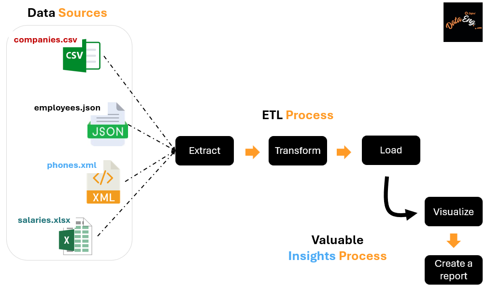
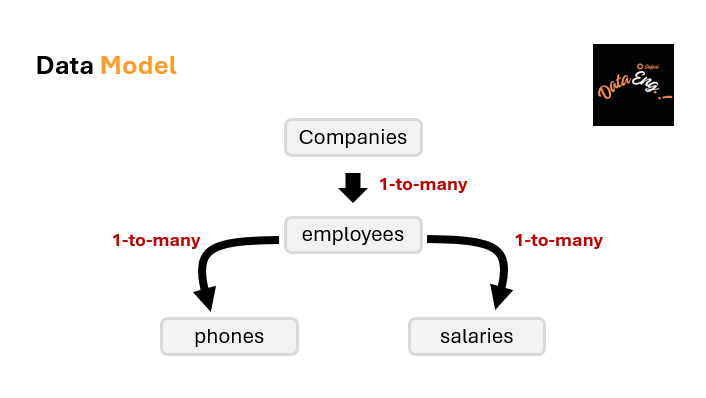

# What will be covered

## Step 1: ETL (Extract Transform Load) process using Power BI

ETL stands for Extract, Transform, Load. It is a process used in data integration and data warehousing. In ETL, data is first **extracted from various sources**, then **transformed or manipulated to meet specific requirements**, and finally **loaded into a target system or database for analysis and reporting purposes**.

## Step 2: Data visualization with Power BI

Power BI is a data visualization tool by Microsoft. It allows users to **connect to different data sources (Extract)**, **transform these data**, **create interactive visualizations**, and **generate reports and dashboards**. Its intuitive interface and extensive range of visualization options make it a popular choice for analyzing and presenting data in a visually appealing and meaningful way.

