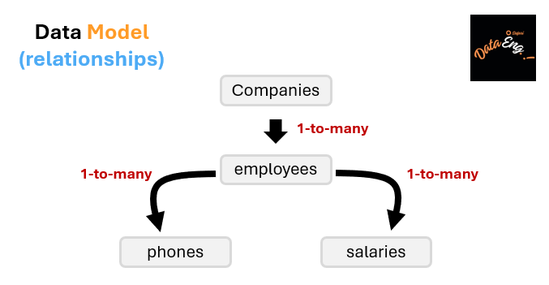
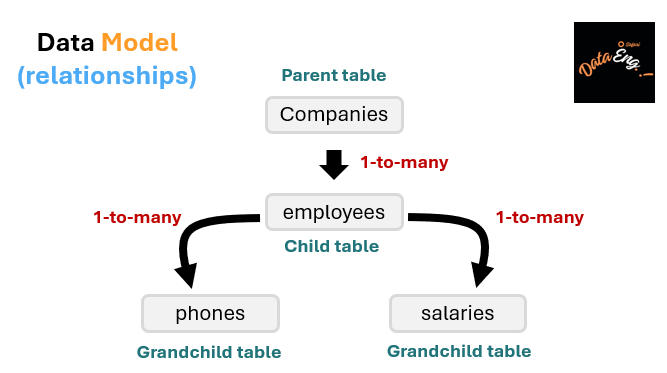

# What will be covered

## Step 1: ETL (Extract Transform Load) process using Power BI

ETL stands for Extract, Transform, Load. It is a process used in data integration and data warehousing. In ETL, data is first **extracted from various sources**, then **transformed or manipulated to meet specific requirements**, and finally **loaded into a target system or database for analysis and reporting purposes**.

1. Extract

This operation involves extracting or retrieving data from various sources such as databases, files, APIs, or web services. The data is collected and copied from the source systems to a staging area.

In our case, we have data from different sources, each with a specific data format: `(a) CSV (b) JSON (c) XML and (d) XLSX`.

2. Transform

In this operation, the extracted data undergoes transformations to ensure its quality, consistency, and compatibility. Transformations include cleaning, filtering, aggregating, joining, and restructuring the data as per the business requirements.

In our case, we will make only two transformations in the `following order`:

* **Transformation 1:** remove blank rows in `phones` table

In `phones`, we have 10% of blank rows.

* **Transformation 2:** join the tables following the data model

3. Load

The transformed data is loaded into the target system, typically a data warehouse, a data mart, or a database. This step involves mapping the transformed data to the appropriate tables or schema in the target system.

In our case, the target system is our current Power BI project' store.

## Step 2: Data visualization with Power BI

Power BI is a data visualization tool by Microsoft. It allows users to **connect to different data sources (Extract)**, **transform these data**, **create interactive visualizations**, and **generate reports and dashboards**. Its intuitive interface and extensive range of visualization options make it a popular choice for analyzing and presenting data in a visually appealing and meaningful way.

